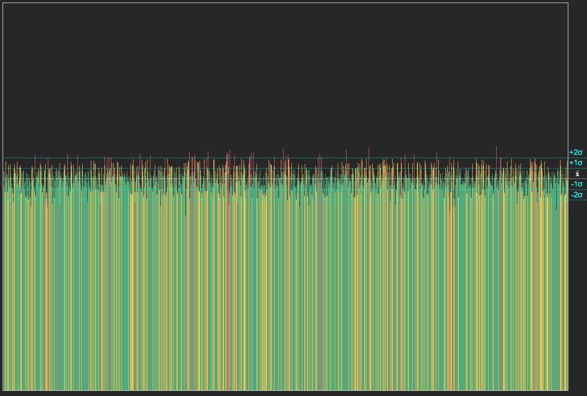

## Gerador de histograma para testar o random do JS

Para alterar a quantidade de números gerados altere a constante repeatRandom e para aumentar o range do random altere a constante randomRange.

```JS
const repeatRandom = 700000;
const randomRange = 1800;
```

>Exemplo de gráfico gerado:
>

A linha branca horizontal demarca a frequência média.
Enquanto as linhas azuis ciano horizontais são os desvios padrões.

No histograma as linhas verdes são frequências dentro do primeiro desvio padrão, as linhas amarelas estão entre o segundo e primeiro desvio padrão e as linhas vermelhas acima de dois desvios padrões.
